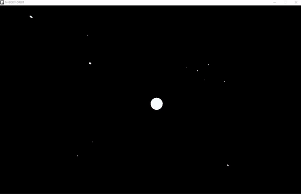

# 3D N-BDOY ORBITAL MECHANICS
3D with N finite orbiters using Kepler equations and raylib dir c-99

## Running the 3D N-BDOY ORBITAL MECHANICS program:

In the npp file, Press F6 and compile_run to run the program

This is what you should see:

[]

# USE
 'z' to add a random orbiter
 'x' to add a perfect orbiter around biggest star
 'e' clear all orbiters
